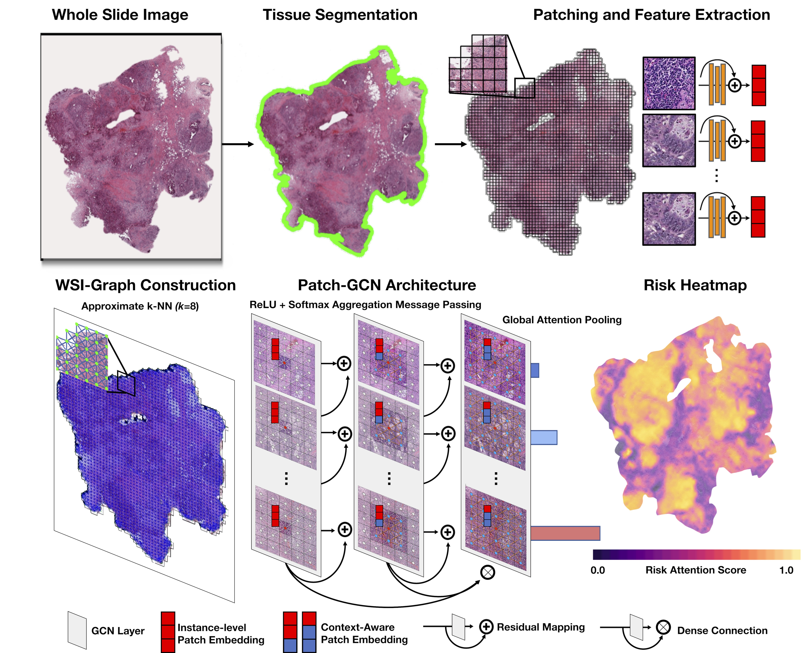

Whole Slide Images are 2D Point Clouds: Context-Aware Survival Prediction using Patch-based Graph Convolutional Networks
===========

<details>
<summary>
  <b>Whole Slide Images are 2D Point Clouds: Context-Aware Survival Prediction using Patch-based Graph Convolutional Networks</b>, MICCAI 2021.
  <a href="https://rdcu.be/cymao" target="blank">[HTML / Reviews]</a>
  <a href="https://arxiv.org/abs/2107.13048" target="blank">[arXiv]</a>
  <a href="https://www.youtube.com/watch?v=KHv7ccs9FAI" target="blank">[Talk]</a>
  <br><em>Richard J Chen, Ming Y Lu, Muhammad Shaban, Chengkuan Chen, Tiffany Y Chen, Drew FK Williamson, Faisal Mahmood</em></br>
</summary>

```bash
@incollection{chen2021whole,
  title={Whole Slide Images are 2D Point Clouds: Context-Aware Survival Prediction using Patch-based Graph Convolutional Networks},
  author={Chen, Richard J and Lu, Ming Y and Shaban, Muhammad and Chen, Chengkuan and Chen, Tiffany Y and Williamson, Drew FK and Mahmood, Faisal},
  doi = {10.1007/978-3-030-87237-3_33},
  url = {https://doi.org/10.1007/978-3-030-87237-3_33},
  publisher = {Springer International Publishing},
  pages = {339--349},
  booktitle = {Medical Image Computing and Computer Assisted Intervention {\textendash} {MICCAI} 2021},
  year = {2021}
}
```
</details>

**Summary:** We formulate WSIs as graphs with patch features as nodes connected via k-NN by their (x,y)-coordinate (similar to a point cloud). Adapting message passing via GCNs on this graph structure would enable learning context-aware embeddings (in contrast with instance-level features that are simply pooled in MIL frameworks).


## Updates
Please follow this GitHub for more updates.
- [X] 6/26/2022: At the time of running the experiments for Patch-GCN, torch_geometric (1.6.3) was used. There have been some reported issues (via email) in which for newer torch_geometric versions, the loss function for Patch-GCN bcomes unstable for other tasks (e.g. - classification). I have managed to circumvent this issue on my own via removing the final [nn.Dropout function](https://github.com/mahmoodlab/Patch-GCN/blob/e2de8c3dc10e7de2b3f8c1ce1d4a243f2fee7dc5/models/model_graph_mil.py#L57) in the model definition. Still not clear why making this improves classification tasks (in my experimentation), but hopefully this should mitigate any issues for your experiments.

## Installation Guide
### Pre-requisites:
* Linux (Tested on Ubuntu 18.04) 
* NVIDIA GPU (Tested on Nvidia GeForce RTX 2080 Ti x 16) with CUDA 11.0 and cuDNN 7.5
* Python (3.7.7), h5py (2.10.0), matplotlib (3.1.1), numpy (1.18.1), opencv-python (4.1.1), openslide-python (1.1.1), openslide (3.4.1), pandas (1.1.3), pillow (7.0.0), PyTorch (1.6.0), scikit-learn (0.22.1), scipy (1.4.1), tensorflow (1.13.1), tensorboardx (1.9), torchvision (0.7.0), captum (0.2.0), shap (0.35.0), torch_geometric (1.6.3)

### Conda Installation:
To install the dependencies for this project via conda, see the [installation guide here](https://github.com/miccai2021anon/2410/blob/master/docs/INSTALLATION.md).

### Downloading TCGA Data
To download diagnostic WSIs (formatted as .svs files), please refer to the [NIH Genomic Data Commons Data Portal](https://portal.gdc.cancer.gov/) and the [cBioPortal](https://www.cbioportal.org/). WSIs for each cancer type can be downloaded using the [GDC Data Transfer Tool](https://docs.gdc.cancer.gov/Data_Transfer_Tool/Users_Guide/Data_Download_and_Upload/).

## Processing Whole Slide Images + Graph Construction
To process WSIs, first, the tissue regions in each biopsy slide are segmented using Otsu's Segmentation on a downsampled WSI using OpenSlide. The 256 x 256 patches without spatial overlapping are extracted from the segmented tissue regions at the desired magnification. Consequently, a pretrained truncated ResNet50 is used to encode raw image patches into 1024-dim feature vectors, which we then save as `.pt` files for each WSI. For permutation-invariant set-based approaches, the extracted features then serve as input (in a `.pt` file) to the network. For graph-based approaches, we additionally use k-nearest neighbors (`k=8`) to connect edges between feature vectors (w.r.t. to either latent feature similarity or spatial coordinate similarity) (Please see our [Jupyter Notebook on Graph Construction](https://github.com/mahmoodlab/Patch-GCN/blob/master/WSI-Graph%20Construction.ipynb)). The following folder structure is assumed for the extracted features vectors:    
```bash
DATA_ROOT_DIR/
    └──TCGA_BLCA/
        ├── slide_1.pt
        ├── slide_2.pt
        └── ...
    └──TCGA_BRCA/
        ├── slide_1.pt
        ├── slide_2.pt
        └── ...
    └──TCGA_GBMLGG/
        ├── slide_1.pt
        ├── slide_2.pt
        └── ...
    └──TCGA_LUAD/
        ├── slide_1.ptd
        ├── slide_2.pt
        └── ...
    └──TCGA_UCEC/
        ├── slide_1.pt
        ├── slide_2.pt
        └── ...
    ...
```
DATA_ROOT_DIR is the base directory of all datasets / cancer type(e.g. the directory to your SSD). Within DATA_ROOT_DIR, each folder contains a list of .pt files for that dataset / cancer type.


## Training-Validation Splits
For evaluating the algorithm's performance, we randomly partitioned each dataset using 5-fold cross-validation (at the patient level). Splits for each cancer type are found in the [splits/5foldcv](https://github.com) folder, which each contain `splits_{k}.csv` for k = 1 to 5. In each `splits_{k}.csv`, the first column corresponds to the TCGA Case IDs used for training, and the second column corresponds to the TCGA Case IDs used for validation. Alternatively, one could define their own splits, however, the files would need to be defined in this format. The dataset loader for using these train-val splits are defined in the [get_split_from_df](https://github.com/miccai2021anon/2410/blob/f9d0befe164d52d1f5ad7217618b99d261511162/datasets/dataset_survival.py#L173) function in the [Generic_WSI_Survival_Dataset](https://github.com/miccai2021anon/2410/blob/f9d0befe164d52d1f5ad7217618b99d261511162/datasets/dataset_survival.py#L20) class (inherited from the PyTorch Dataset class).


## Running Experiments
To run experiments using the networks defined in this repository, experiments can be run using the following generic command-line:
```shell
CUDA_VISIBLE_DEVICES=<DEVICE ID> python main.py --which_splits <SPLIT FOLDER PATH> --split_dir <SPLITS FOR CANCER TYPE> --mode <WHICH MODALITY> --model_type <WHICH MODEL>
```
Commands for all experiments / models can be found in the [Commands.md](https://github.com/miccai2021anon/2410/blob/master/docs/Commands.md) file.


## Attention Heatmaps
Attention heatmaps can be created via saving the attention scores from global attention pooling, applying `cv2.COLORMAP_MAGMA` in OpenCV (or your favorite colormap) to the attention scores to create a colored patch, then blending and overlaying the colored patch with the original H&E patch using OpenSlide. For models that compute attention scores, attention scores can be saved during the [Forward pass](https://github.com/miccai2021anon/2410/blob/10a4c61386f15cb68b0f4664ac473d976114035d/models/model_set_mil.py#L107).

## Example Model Input for Patch-GCN ( + Speed Benchmark)
To inspect underneath the hood of Patch-GCN and see how inputs are organized (as well as speed in loading large graphs), see the [following Jupyter Notebook](https://github.com/miccai2021anon/2410/blob/master/Inference%20Benchmark.ipynb).

## Issues
- Please open new threads or report issues directly (for urgent blockers) to richardchen@g.harvard.edu.
- Immediate response to minor issues may not be available.


## License & Usage 
If you find our work useful in your research, please consider citing our paper at:
```bash
@incollection{chen2021whole,
  title={Whole Slide Images are 2D Point Clouds: Context-Aware Survival Prediction using Patch-based Graph Convolutional Networks},
  author={Chen, Richard J and Lu, Ming Y and Shaban, Muhammad and Chen, Chengkuan and Chen, Tiffany Y and Williamson, Drew FK and Mahmood, Faisal},
  doi = {10.1007/978-3-030-87237-3_33},
  url = {https://doi.org/10.1007/978-3-030-87237-3_33},
  publisher = {Springer International Publishing},
  pages = {339--349},
  booktitle = {Medical Image Computing and Computer Assisted Intervention {\textendash} {MICCAI} 2021},
  year = {2021}
}
```

© [Mahmood Lab](http://www.mahmoodlab.org) - This code is made available under the GPLv3 License and is available for non-commercial academic purposes. 
